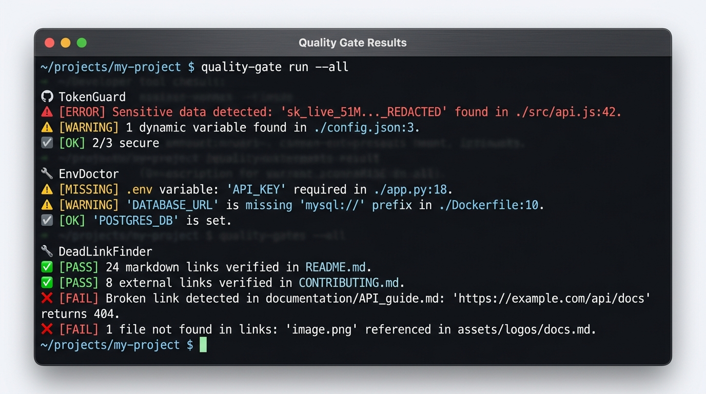

# Developer Quality Toolkit 🛡️

[](https://github.com/umutgungorr/developer-quality-toolkit/actions/workflows/quality-gate.yml)
[](https://github.com/marketplace?type=actions&query=umutgungorr)
[](https://github.com/umutgungorr/developer-quality-toolkit)
[](https://docs.oasis-open.org/sarif/sarif/v2.1.0/sarif-v2.1.0.html)
[](https://opensource.org/licenses/MIT)

> **A curated, zero-runtime-dependency toolkit of security, configuration, and documentation linters for modern Git repositories and GitHub Actions.**

<p align="center">
  
</p>

---

## 🌟 The Toolkit Suite

| Tool | Problem It Solves | Key Capabilities | PyPI Package | Marketplace Action | Release |
| :--- | :--- | :--- | :--- | :--- | :---: |
| 🛡️ **[TokenGuard](https://github.com/umutgungorr/tokenguard)** | Accidental secret & credential leaks | Pre-commit Git hook, Shannon entropy scan, baseline suppression, OASIS SARIF v2.1.0 | [](https://pypi.org/project/tokenguard-cli/) | [`umutgungorr/tokenguard`](https://github.com/marketplace/actions/tokenguard-secret-scanner) | [`v0.2.0`](https://github.com/umutgungorr/tokenguard/releases/tag/v0.2.0) |
| 🩺 **[EnvDoctor](https://github.com/umutgungorr/envdoctor)** | Environment contract drift & missing vars | `.env` vs `.env.example` sync, multiline quoted values, AST codebase variable audit | [](https://pypi.org/project/envdoctor-cli/) | [`umutgungorr/envdoctor`](https://github.com/marketplace/actions/envdoctor-integrity-linter) | [`v0.2.0`](https://github.com/umutgungorr/envdoctor/releases/tag/v0.2.0) |
| 🔗 **[DeadLinkFinder](https://github.com/umutgungorr/deadlinkfinder)** | Broken docs, 404 images & missing anchors | Offline-first relative link check, GitHub heading-anchor engine, SARIF line fingerprints | [](https://pypi.org/project/deadlinkfinder/) | [`umutgungorr/deadlinkfinder`](https://github.com/marketplace/actions/deadlinkfinder-markdown-checker) | [`v0.2.1`](https://github.com/umutgungorr/deadlinkfinder/releases/tag/v0.2.1) |

### 📦 Local CLI Installation

Install all three zero-dependency tools directly from PyPI:

```bash
pip install tokenguard-cli envdoctor-cli deadlinkfinder
```

Now run any tool directly in your terminal:
```bash
tokenguard --staged
envdoctor check --strict
deadlinkfinder docs/
```

---

## ⚡ Instant GitHub Actions Quality Gate

Drop this workflow into `.github/workflows/quality-gate.yml` to guard any repository against secret leaks, broken environment contracts, and broken documentation:

```yaml
name: Quality Gate Suite

on:
  push:
    branches: [main]
  pull_request:

permissions:
  contents: read
  security-events: write

jobs:
  verify:
    runs-on: ubuntu-latest
    steps:
      - name: Checkout
        uses: actions/checkout@v4

      - name: Set up Python 3.12
        uses: actions/setup-python@v5
        with:
          python-version: '3.12'

      # 1. Secret Scanning
      - name: TokenGuard Secret Scan
        uses: umutgungorr/tokenguard@v0.2.0
        with:
          format: 'sarif'
          output: 'tokenguard.sarif'

      # 2. Environment Verification
      - name: EnvDoctor Contract Check
        uses: umutgungorr/envdoctor@v0.2.0
        with:
          command: 'check'
          env-file: '.env'
          example-file: '.env.example'

      # 3. Documentation Verification
      - name: DeadLinkFinder Markdown Check
        uses: umutgungorr/deadlinkfinder@v0.2.1
        with:
          format: 'sarif'
          output: 'deadlinks.sarif'

      # 4. Upload SARIF to GitHub Security tab
      - name: Upload Security Reports
        uses: github/codeql-action/upload-sarif@v3
        if: always()
        with:
          sarif_file: 'tokenguard.sarif'
          category: 'tokenguard'
```

---

## 🏛️ Architecture & Principles

1. **Zero Runtime Dependencies**: Every tool in this suite runs strictly on the Python 3 standard library. No `pip install` failures, no supply-chain dependency vulnerabilities, and minimal runner overhead.
2. **Deterministic Outputs**: Explicit exit codes (`0` clean, `1` violation, `2` execution error) for reliable CI/CD pipeline control.
3. **Native OASIS SARIF v2.1.0**: Standardized security findings mapped directly to GitHub Code Scanning and Security tabs.
4. **Privacy-First**: 100% offline execution. Source code, secrets, and environment configurations never leave your machine or runner.

---

## 🗺️ Ecosystem Roadmap

- [x] Composite GitHub Actions published to GitHub Marketplace
- [x] Native OASIS SARIF v2.1.0 output support with stable fingerprints
- [x] Pre-commit hook integrations
- [ ] PyPI distribution packages (`pipx install tokenguard-cli`)
- [ ] Unified CLI orchestrator (`devguard check`)

---

## 📄 License

MIT License. See [LICENSE](LICENSE) for details.
